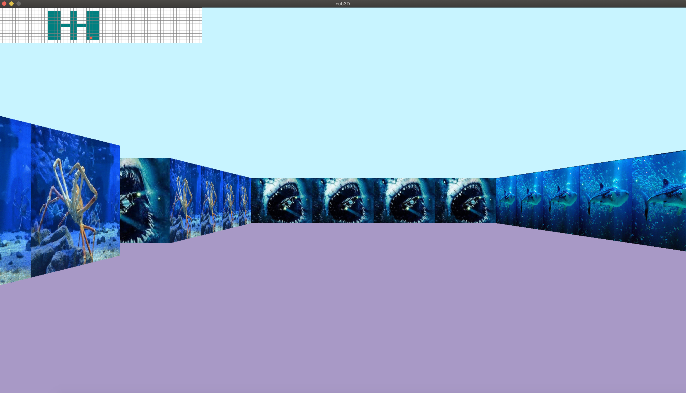

> # 🎮 cub3D

[MiniLibX library](https://harm-smits.github.io/42docs/libs/minilibx) 라이브러리를 사용하여 [Wolfenstein 3D](http://users.atw.hu/wolf3d/)게임의 스타일로 Ray-casting을 사용하여 구현하기.



<br>

## ✅ 구현 기능

- 창 전환 시 부드러운 동작 유지 (창 최소화 및 다른 창으로 전환 가능)
- 벽이 바라보는 방향(북, 남, 동, 서)에 따라 텍스처가 달라짐
- 서로 다른 색상의 바닥 및 천장 설정 가능
- .cub 파일을 사용한 맵 구성 지원
- 플레이어의 시점 이동: 좌우 화살표 키로 시점 회전
- 플레이어의 이동: W, A, S, D 키로 미로 내 이동
- ESC 키 또는 창 닫기를 통해 프로그램 정상 종료
- `벽 충돌`: 플레이어가 벽을 통과하지 못하게 구현
- `미니맵`: 플레이어의 현재 위치를 보여주는 미니맵 기능
- `마우스 회전`: 마우스를 사용하여 플레이어의 시점을 회전 가능

<br>

## ⌨️ 실행 방법

MacOS 환경에서만 테스트되었습니다. 다른 운영체제에서 테스트 할 경우 [42 Docs](https://harm-smits.github.io/42docs/libs/minilibx/getting_started.html)를 확인해야 합니다.

1. 프로그램 설치 및 루트 디렉토리로 이동

```shell
git clone https://github.com/GCgang/cub3d.git && cd cub3d
```

2. 프로그램 빌드

```
make
```

3. 프로젝트 실행

```
./cub3D map/aquarium/aqua.cub
```

<br>

## 🕹 Controls

| 키                          | 기능                      |
| --------------------------- | ------------------------- |
| <kbd>W</kbd>                | 앞으로 이동               |
| <kbd>S</kbd>                | 뒤로 이동                 |
| <kbd>A</kbd>                | 왼쪽으로 이동             |
| <kbd>D</kbd>                | 오른쪽으로 이동           |
| <kbd>←</kbd>               | 왼쪽으로 회전             |
| <kbd>→</kbd>               | 오른쪽으로 회전           |
| <kbd>ESC</kbd> 또는 창 닫기 | 프로그램 종료             |
| <kbd>마우스 이동</kbd>      | 마우스를 사용한 시점 회전 |

<br>

## Team

| [💻 GCgang](https://github.com/GCgang) | [💻 Atomic](https://github.com/jaehjoo) |
| -------------------------------------- | --------------------------------------- |
| **Parsing**                            | **Execution**                           |
